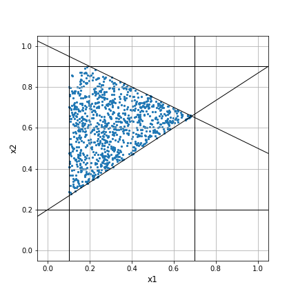

# polytope-sampling
This package provides functions to uniformly sample points subject to a system of linear inequality constraints, `A1 x <= b1` (convex polytope), and linear equality constraints, `A2 x = b2` (affine subspace).

### Example
Let's sample 1000 points from R² subject to following inequality constraints
* 0.1 <= x1 <= 0.9
* 0.2 <= x2 <= 1
* 0.5 x1 + x2 <= 1
* -2/3 x1 + x2 >= 0.2

```python
import polytope
import numpy as np

# bounds
lower = [0.1, 0.2]
upper = [0.7, 0.9]

# inequality constraints
A1 = np.array([[1 / 2, 1], [2 / 3, -1]])
b1 = np.array([1, -0.2])

points = polytope.sample(n_points=1000, lower=lower, upper=upper, A1=A1, b1=b1)
```


### References
A comparison of MCMC algorithms to generate uniform samples over a convex polytope is given in [Chen2018].
Here, we use the Hit & Run algorithm described in [Smith1984].
The R-package [hitandrun] provides similar functionality to this package.

[Chen2018]: Chen Y., Dwivedi, R., Wainwright, M., Yu B. (2018) Fast MCMC Sampling, Algorithms on Polytopes. JMLR, 19(55):1−86. https://arxiv.org/abs/1710.08165
[Smith1984]: Smith, R. (1984). Efficient Monte Carlo Procedures for Generating Points Uniformly Distributed Over Bounded Regions. Operations Research, 32(6), 1296-1308. www.jstor.org/stable/170949
[hitandrun]: https://cran.r-project.org/web/packages/hitandrun/index.html
